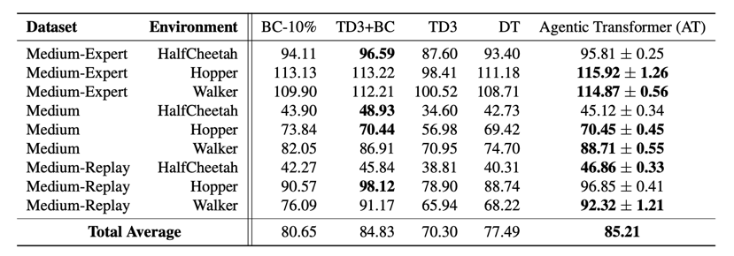
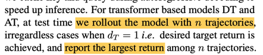
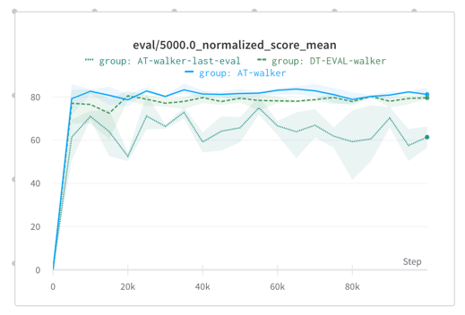

# Evaluation in Agentic Transformer Paper

In a recent paper (Liu, Abbeel 2023) an Agentic Transformer was introduced. This is a case of in-context 
reinforcement learning, which uses so-called "chain of hindsight". In short, it is a special way how one can organize 
the data inside a context of Transformer. They propose to precondition Transformer during training with randomly 
selected trajectories from the dataset, which are ordered in ascending fashion by a total episode return.

The results are quite remarkable. Not only it improves over imitation-learning algorithms (TD), but also it beats 
TD-like algorithms. 


When reproducing, we notice a subtle detail in the paper. Authors used the following evaluation protocol:



So as we understood, authors make $N$ rollouts with n episodes in each (so $n$ is the number of in-context 
episodes) and then they take the maximum from $n$ and average over $N$. However, this protocol may significantly 
boost the reported returns. 

As an example, we run a plain DT (Chen et al., 2021) without any context with the same protocol (organize $N$ 
episodes in 
groups of 
$n$, then take the maximum from $n$ and average over $N$). We run an experiment on a `walker-medium-replay-v2` dataset, 
as AT showed the highest boost in comparison to DT.  It turned out that using such evaluation can boost  the returns 
by almost 33%. On a picture DT with an evaluation protocol from AT is drawn with a dotted line, AT is a solid line.

 

> **It should be noted** that we base our implementation on a DT algorithm from CORL (Tarasov et al., 2023), where a
plain DT scores 59.86 ± 2.73, which is lower than in AT's implementation of DT. Also, due to some limitations, we 
could fit `rewards` token into the context of Transformer. Authors did an ablation study without this token and 
reported 80.43 average on D4RL, not specifying for datasets.

To emphasize the difference, we also run the following evaluation for AT: we run $N$ episodes with $n$ episodes in 
each context, then take **the last** episode return from each group of $n$, then average over $N$. As authors claim, 
the AT should score more with each episode in-context, so we think that our evaluation has some intuitive grounds. 
As a result, we got almost the same returns as in CORL DT. 

All returns are reported across 3 seeds.
The wandb logs may be found here: https://wandb.ai/tlab/ORDER/reports/Different-Evaluation-Protocols--Vmlldzo1MTkyODQ5

# Code Organization

Since the difference in evaluation protocols is minor in terms of code, file `at.py` contains an implementation of a 
proposed algorithm. Evaluation rollouts are generated by a `eval_rollout` function on line 498. Then unreduced 
returns are fed into one of the eval protocols from `eval_protocols.py`.

Decision Transformer is taken from CORL and is subject to a minor change. To reproduce AT's evaluation we form a 
quasi-in-context episodes by grouping returns by four. Namely, on lines 537-538 we do:

```python
    eval_returns = np.array(eval_returns).reshape(-1, 4)
    eval_returns = np.max(eval_returns, axis=-1)
```

Configs are stored in a `configs` folder. DT's configs are from CORL, AT's are from the paper.

# References
[Liu, Abbeel 2023, Emergent Agentic Transformer from Chain of Hindsight Experience](https://arxiv.org/pdf/2305.16554)

[Chen et al. 2021, Decision Transformer: Reinforcement Learning via Sequence Modeling](https://arxiv.org/pdf/2106.01345)

[Clean Offline Reinforcement Learning](https://github.com/corl-team/CORL)